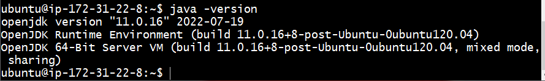
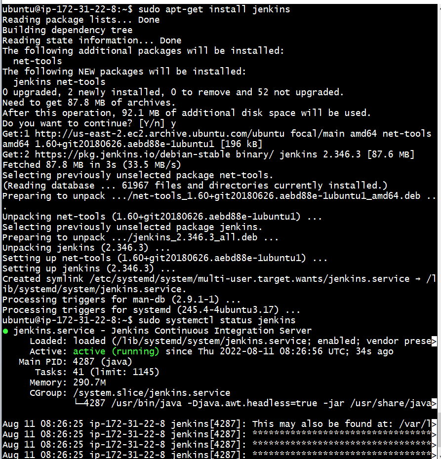
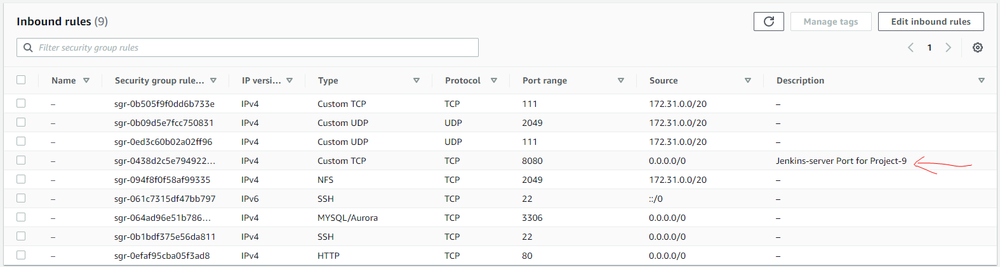
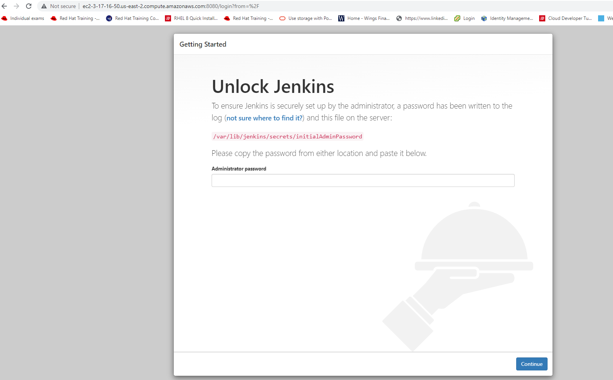
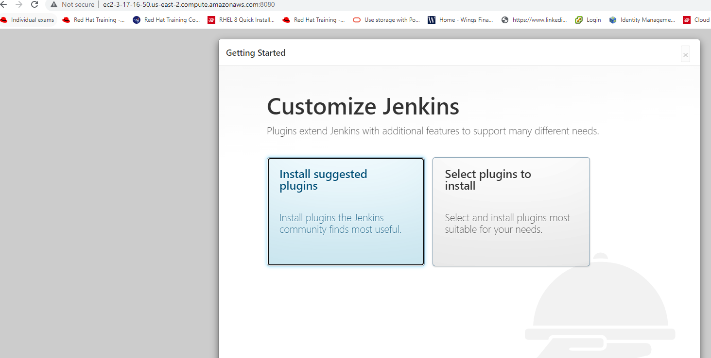
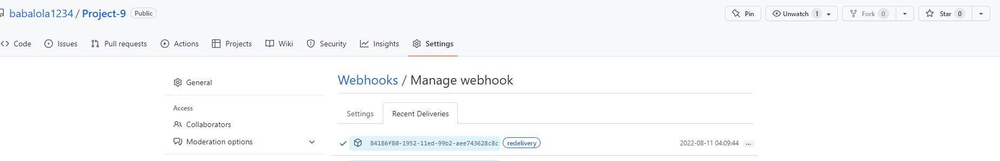
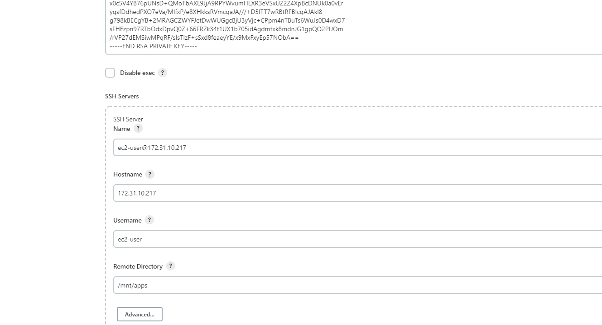
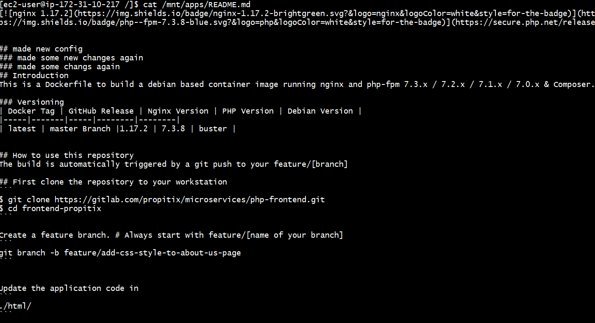

# TOOLING WEBSITE DEPLOYMENT AUTOMATION WITH CONTINUOUS INTEGRATION. INTRODUCTION TO JENKINS

* Adding a Jenkins server to existing architecture in project 8 to configure a job to automatically deploy source codes changes from Git to NFS server.

### Installed and configured JENKINS SERVER

* Step 1 – Created a new EC2 server based on Ubuntu Server 20.04 LTS and named it "Jenkins"

* I Installed JDK (since Jenkins is a Java-based application)

` sudo apt update `

` sudo apt install default-jdk-headless -y`

* Installing  Jenkins below-- first, I downloaded the package before installing it.

` wget -q -O - https://pkg.jenkins.io/debian-stable/jenkins.io.key | sudo apt-key add - `

` sudo sh -c 'echo deb https://pkg.jenkins.io/debian-stable binary/ > \
    /etc/apt/sources.list.d/jenkins.list' `

` sudo apt update `

` sudo apt-get install jenkins -y `

* verified Jenkins is up and running

` sudo systemctl status jenkins `

* By default Jenkins server uses TCP port 8080, this port is opened in the Inbound Rule in EC2 Security Group

* I Opened jenkins server from my browser and used default admin password located in /var/lib/jenkins/secrets/initialAdminPassword dir

` http://ec2-3-17-16-50.us-east-2.compute.amazonaws.com:8080 `

` sudo cat /var/lib/jenkins/secrets/initialAdminPassword ` 

* I installed all suggested plugins 

### Step 2 --Configured Jenkins to retrieve source codes from GitHub using Webhooks

* I Enabled webhooks in my GitHub repository settings

### CONFIGURE JENKINS TO COPY FILES TO NFS SERVER VIA SSH

### Step 3 – Configured Jenkins to copy files to NFS server via SSH

* artifacts is saved locally on Jenkins server, 
  the next step is to copy them to our NFS server to /mnt/apps directory.

* To do that, a plugin that is called "Publish Over SSH". is installed
  
### below are  configured on my jenkins server

* Provided a private key (content of .pem)
* nfs server name
* nsf server - Hostname – can be private IP address of your NFS server
* Username – ec2-user (since NFS server is based on EC2 with RHEL 8)
* Remote directory – /mnt/apps since 
*  configuration tested and  connection returns Success. 

* TCP port 22 on NFS server is  opened to receive SSH connections.

